# A+ - Peripherals and Power Supply Assignment

# DAY - 1: Overview of Peripherals

## Topic: Printers, Scanners, Webcams and Connection Interfaces

Peripherals are external hardware devices connected to a computer to perform input, output, communication, or storage-related tasks. Common examples of peripherals include printers, scanners, webcams, keyboards, mice, speakers, and external drives.

Printers are used to create physical copies of digital documents. Scanners convert paper documents into digital files. Webcams capture video and are commonly used for online classes, meetings, interviews, and video calls.

Printers can be connected to a computer using different methods such as USB, Wi-Fi, Bluetooth, Parallel Port, Ethernet/LAN, or by adding a network printer through its IP address.

---

## 1. Types of Printers, Scanners, and Webcams With Real-Life Use Cases

| Device Category | Type | Function | Real-Life Use Case |
|---|---|---|---|
| Printer | Inkjet Printer | Prints using liquid ink cartridges. | Printing college assignments, project reports, and color images. |
| Printer | Laser Printer | Prints using toner powder and laser technology. | Printing office documents, notes, invoices, and bulk pages. |
| Printer | Thermal Printer | Prints using heat on thermal paper. | Printing shopping bills, ATM receipts, and POS receipts. |
| Scanner | Flatbed Scanner | Scans documents placed on a glass surface. | Scanning certificates, ID cards, forms, and photos. |
| Scanner | Sheet-fed Scanner | Scans multiple pages using an automatic feeder. | Scanning office documents and multiple-page forms quickly. |
| Webcam | Built-in Webcam | Camera already installed in a laptop. | Attending online classes, meetings, and interviews. |
| Webcam | External USB Webcam | Separate camera connected through USB. | High-quality video calls, online teaching, and live streaming. |

---

## 2. Labeled Diagram: Home Printer Connected to Laptop or PC

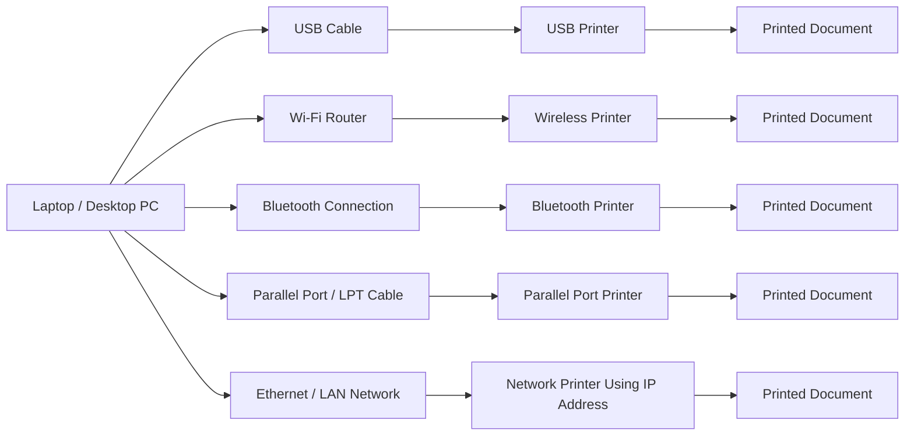

### Explanation

A printer can be connected to a laptop or desktop computer using different connection methods.

| Connection Method | Description |
|---|---|
| USB | A wired connection where the printer is directly connected to the computer using a USB cable. |
| Wi-Fi | A wireless connection where the printer and computer are connected to the same Wi-Fi network. |
| Bluetooth | A short-range wireless connection used by Bluetooth-supported printers. |
| Parallel Port | An older wired printer connection also called LPT port, mostly used in old desktop computers and printers. |
| IP Address / Network Printing | A printer connected to a network can be added to a computer using its IP address. This is common in offices, labs, and colleges. |

---

## 3. Peripheral Connection Interfaces

| Connection Interface | Used With | Advantage | Disadvantage |
|---|---|---|---|
| USB | Printers, scanners, webcams, keyboards, mouse | Fast, stable, easy to use, and widely supported. | Requires a cable and has limited distance. |
| Wi-Fi | Wireless printers, scanners, smart devices | Allows wireless connection and supports multiple devices. | Requires network setup and depends on Wi-Fi signal strength. |
| Bluetooth | Printers, webcams, speakers, wireless devices | Useful for short-range wireless connection without cables. | Slower than USB and Wi-Fi, with limited range. |
| Parallel Port / LPT | Older printers | Reliable for old printers and legacy systems. | Very old technology and not available in most modern laptops. |
| Ethernet / IP Address | Network printers | Allows multiple computers to print using the same printer over a network. | Requires IP configuration and network connection. |

---

## 4. Step-by-Step Setup: Connecting a Printer to a Computer

### Selected Device

Printer

### Connection Methods

A printer can be connected using USB cable, Wi-Fi, Bluetooth, Parallel Port, Ethernet/LAN, or IP address-based network printing.

---

## Method 1: Connecting a Printer Using USB

### Required Items

| Item | Purpose |
|---|---|
| Printer | Output device used for printing documents. |
| Laptop or Desktop PC | Computer used to send print commands. |
| USB Cable | Connects the printer directly to the computer. |
| Printer Driver | Helps the operating system communicate with the printer. |
| Paper and Ink/Toner | Required for printing output. |

### Steps

#### Step 1: Place the Printer Near the Computer

Place the printer close to the laptop or desktop so that the USB cable can connect properly.

#### Step 2: Connect the Power Cable

Connect the printer power cable to the power socket and turn on the printer.

#### Step 3: Connect the USB Cable

Connect one end of the USB cable to the printer and the other end to the computer’s USB port.

#### Step 4: Wait for Device Detection

The computer will detect the printer automatically. In most cases, Windows installs the basic printer driver automatically.

#### Step 5: Install the Printer Driver

If the printer is not detected automatically, install the driver from the printer manufacturer’s official website.

#### Step 6: Add Printer from Settings

Open the computer settings and follow this path:

```text
Settings → Bluetooth & devices → Printers & scanners → Add device
```

Select the printer from the list and add it.

#### Step 7: Print a Test Page

Print a test page to confirm that the printer is connected and working properly.

---

## Method 2: Connecting a Printer Using Wi-Fi

A Wi-Fi printer can be connected wirelessly if both the computer and printer are on the same network.

### Steps

1. Turn on the printer.
2. Connect the printer to the Wi-Fi network.
3. Connect the laptop or desktop to the same Wi-Fi network.
4. Open printer settings on the computer.
5. Select **Add printer**.
6. Choose the wireless printer from the list.
7. Install the driver if required.
8. Print a test page.

---

## Method 3: Connecting a Printer Using IP Address

A network printer can be connected using its IP address. This method is commonly used in offices, computer labs, colleges, and shared printer setups.

### Steps

1. Turn on the printer.
2. Connect the printer to the same LAN or Wi-Fi network as the computer.
3. Find the printer IP address from the printer display, printer settings page, or network configuration page.
4. Open printer settings on the computer.

```text
Settings → Bluetooth & devices → Printers & scanners
```

5. Click on **Add device**.
6. If the printer is not found automatically, select **Add manually**.
7. Choose **Add a printer using an IP address or hostname**.
8. Enter the printer IP address.
9. Install the required printer driver.
10. Print a test page to confirm the connection.

---

## Method 4: Connecting an Old Printer Using Parallel Port

Some old printers use a Parallel Port, also called an LPT port. This type of connection is mostly found in older desktop computers and older printers.

### Steps

1. Turn off the computer and printer.
2. Connect the parallel cable to the printer’s parallel port.
3. Connect the other end of the cable to the computer’s LPT port.
4. Turn on the printer and computer.
5. Install the printer driver if required.
6. Add the printer from printer settings.
7. Print a test page.

---

---

# DAY - 2: SMPS, UPS and Power Connectors

## Topic: Switched Mode Power Supply, UPS and PC Power Connections

SMPS stands for Switched Mode Power Supply. It converts AC power from the wall socket into regulated DC power required by computer components such as motherboard, CPU, storage drives, and graphics card.

UPS stands for Uninterruptible Power Supply. It provides backup power when electricity fails and protects devices from sudden shutdown, voltage fluctuation, and data loss.

---

## 1. Real-World Devices Using SMPS and UPS

### Devices Using SMPS

| No. | Device | Power Supply Type | Reason |
|---|---|---|---|
| 1 | Desktop Computer | SMPS | A desktop PC needs different DC voltages for motherboard, CPU, storage drives, and GPU. |
| 2 | LED Monitor | SMPS | A monitor uses SMPS to convert AC power into stable DC power for display circuits. |
| 3 | Wi-Fi Router | SMPS Adapter | A router needs low-voltage DC power for continuous network operation. |

### Devices Using UPS

| No. | Device | Power Supply Type | Reason |
|---|---|---|---|
| 1 | Desktop Computer | UPS | UPS prevents sudden shutdown and protects unsaved work during power failure. |
| 2 | CCTV System / Network Server | UPS | UPS keeps the system running during power cuts and avoids data or recording loss. |

---

## 2. Labeled Diagram of SMPS Internal Components

```mermaid
flowchart LR
    A[AC Input<br>230V AC Supply] --> B[Fuse and EMI Filter<br>Protection and Noise Filtering]
    B --> C[Rectifier<br>Converts AC to DC]
    C --> D[Filter Capacitor<br>Smooth DC Output]
    D --> E[Switching Circuit<br>High Frequency Switching]
    E --> F[Transformer<br>Voltage Step Down and Isolation]
    F --> G[Output Rectifier<br>Converts High Frequency AC to DC]
    G --> H[Output Filter<br>Stable DC Output]
    H --> I[DC Output<br>3.3V, 5V, 12V]
    I --> J[Motherboard, CPU, GPU, Storage Drives]
```

### Explanation of SMPS Sections

| Section | Function |
|---|---|
| AC Input | Receives AC power from the wall socket. |
| Fuse and EMI Filter | Protects the SMPS from overload and reduces electrical noise. |
| Rectifier | Converts AC voltage into DC voltage. |
| Filter Capacitor | Smooths the rectified DC voltage. |
| Switching Circuit | Switches DC voltage at high frequency for efficient conversion. |
| Transformer | Steps down voltage and provides electrical isolation. |
| Output Rectifier | Converts transformer output into DC voltage. |
| Output Filter | Provides clean and stable DC output. |
| DC Output | Supplies 3.3V, 5V, and 12V power to PC components. |

---

## 3. PC Power Connectors

### Power Connector Reference Images

Upload clear connector images in the repository using the following file names:

```text
atx-24-pin-connector.jpg
sata-power-connector.jpg
molex-connector.jpg
pcie-connector.jpg
```

### ATX 24-pin Motherboard Connector

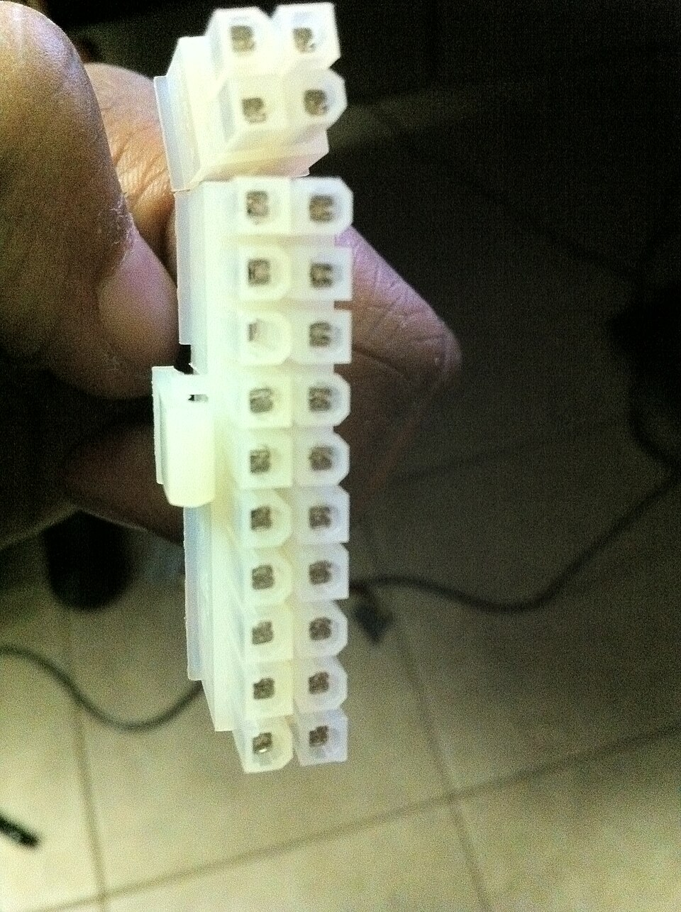

| Detail | Information |
|---|---|
| Connector Name | ATX 24-pin Motherboard Connector |
| Powers | Motherboard |
| Use | Supplies main power to the motherboard. |
| Safety Tip | Align the connector properly and press until the lock clip fits securely. Do not force it in the wrong direction. |

---

### SATA Power Connector


| Detail | Information |
|---|---|
| Connector Name | SATA Power Connector |
| Powers | SATA HDD, SATA SSD, Optical Drive |
| Use | Supplies power to storage devices. |
| Safety Tip | Hold the plastic connector while removing it. Do not pull from the wires. |

---

### Molex Connector

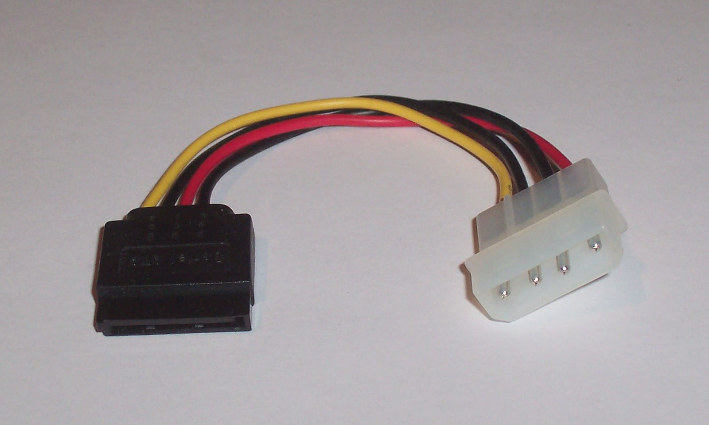

| Detail | Information |
|---|---|
| Connector Name | Molex 4-pin Connector |
| Powers | Older HDD, cabinet fans, older optical drives |
| Use | Provides power to older internal devices and some accessories. |
| Safety Tip | Check pin alignment before connecting because Molex connectors can be tight. |

---

### PCIe 6/8-pin Connector

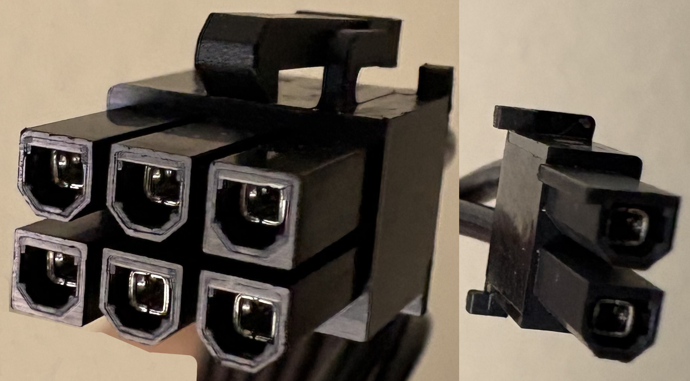

| Detail | Information |
|---|---|
| Connector Name | PCIe 6-pin / 8-pin Connector |
| Powers | Dedicated Graphics Card |
| Use | Supplies extra power to GPU. |
| Safety Tip | Use the correct PCIe cable from the SMPS and ensure the clip locks properly. |

---

## 4. Steps to Connect SMPS in a Gaming PC

### Step 1: Place the SMPS in the Cabinet

Install the SMPS in the PSU mounting area of the cabinet and tighten it with screws.

**Reason:** The SMPS must be fixed properly to supply stable power to all components.

---

### Step 2: Connect ATX 24-pin Connector to Motherboard

Connect the **ATX 24-pin power connector** from the SMPS to the motherboard.

**Cable Used:** ATX 24-pin motherboard power cable  
**Powers:** Motherboard  
**Reason:** This is the main power supply connection for the motherboard.

---

### Step 3: Connect CPU Power Connector

Connect the **4-pin or 8-pin CPU power connector** near the CPU socket on the motherboard.

**Cable Used:** CPU EPS 4-pin / 8-pin power cable  
**Powers:** CPU / Processor  
**Reason:** The CPU requires a separate power supply for processing tasks.

---

### Step 4: Connect PCIe Power Cable to Graphics Card

Connect the **PCIe 6-pin or 8-pin connector** to the dedicated graphics card.

**Cable Used:** PCIe 6-pin / 8-pin power cable  
**Powers:** GPU / Graphics Card  
**Reason:** Gaming graphics cards need extra power for high performance.

---

### Step 5: Connect SATA Power Cable to Storage Devices

Connect the **SATA power connector** to HDD, SSD, or optical drive.

**Cable Used:** SATA power cable  
**Powers:** HDD, SATA SSD, Optical Drive  
**Reason:** Storage devices need power to store and access data.

---

### Step 6: Connect Molex Connector If Required

Connect the **Molex connector** only if older components or cabinet fans require it.

**Cable Used:** Molex 4-pin power cable  
**Powers:** Older drives, fans, accessories  
**Reason:** Some older devices still use Molex power connectors.

---

### Step 7: Check Cable Management

Arrange the power cables properly inside the cabinet.

**Reason:** Good cable management improves airflow and makes the PC safer and cleaner.

---

### Step 8: Final Safety Check

Before turning on the PC, check that all connectors are properly inserted and locked.

**Reason:** Loose power connectors can cause boot failure, overheating, or hardware damage.

---

## SMPS Connection Flow Diagram

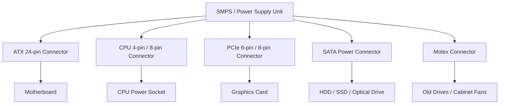

---

## Safety Precautions While Connecting SMPS

| Safety Precaution | Importance |
|---|---|
| Turn off the power supply before connecting cables | Prevents electric shock and short circuit. |
| Disconnect the main power cable | Ensures the PC is fully powered off. |
| Use correct connectors only | Prevents damage to motherboard, GPU, and storage devices. |
| Do not force connectors | Avoids broken pins and damaged ports. |
| Hold connectors from plastic body | Prevents wire damage while removing cables. |
| Check connector lock clips | Ensures secure connection. |
| Keep cables away from fans | Prevents fan blockage and improves airflow. |
| Use proper wattage SMPS | Ensures enough power for gaming PC components. |

---

---

# DAY - 3: Peripheral Troubleshooting

## Topic: Troubleshooting Keyboards, Mice, Bluetooth Headphones, Webcams and Printers

Peripheral troubleshooting means identifying and fixing problems related to external devices connected to a computer or mobile device. Common peripherals include keyboard, mouse, headphones, webcam, printer, scanner, and speakers.

Troubleshooting usually includes checking physical connections, device power, drivers, permissions, settings, and compatibility.

---

## 1. Common Issues With USB Keyboard or Mouse on Laptop

| No. | Common Issue | Possible Cause | Solution |
|---|---|---|---|
| 1 | Keyboard or mouse not detected | Loose USB connection or faulty USB port | Remove and reconnect the device. Try another USB port. |
| 2 | Keyboard keys not working properly | Dust, dirt, or damaged keys | Clean the keyboard gently and test the keys again. |
| 3 | Mouse cursor not moving | Mouse sensor issue or surface problem | Clean the mouse sensor and use a proper mouse pad. |
| 4 | Device disconnects again and again | Power management or driver issue | Update the USB driver and disable USB power saving from Device Manager. |
| 5 | Keyboard or mouse works slowly or lags | Driver problem, low system performance, or faulty device | Restart the laptop, update drivers, and test the device on another computer. |

---

## 2. Troubleshooting Flow: Bluetooth Headphones Not Connecting to Phone

### Problem

Bluetooth headphones are not connecting to the phone.

---

### Step-by-Step Troubleshooting Actions

#### Step 1: Check Headphone Power

First, I would check whether the Bluetooth headphones are turned on.

**Indicator to check:**  
Power LED light or voice prompt such as “Power On”.

---

#### Step 2: Check Battery Level

I would make sure the headphones have enough battery.

**Action:**  
Charge the headphones for a few minutes and then try again.

---

#### Step 3: Turn Bluetooth Off and On

I would turn Bluetooth off and then turn it on again on the phone.

**Phone Setting Path:**

```text
Settings → Bluetooth → Turn Off → Turn On
```

**Reason:**  
Restarting Bluetooth refreshes the connection.

---

#### Step 4: Put Headphones in Pairing Mode

I would press and hold the Bluetooth/power button on the headphones until the LED starts blinking.

**Indicator to check:**  
Blinking blue/red light or voice prompt such as “Pairing Mode”.

---

#### Step 5: Check Available Devices List

I would open Bluetooth settings on the phone and check whether the headphone name appears in the available devices list.

**Phone Setting Path:**

```text
Settings → Bluetooth → Available Devices
```

---

#### Step 6: Forget Old Pairing

If the headphones were already paired earlier, I would remove the old connection.

**Action:**

```text
Settings → Bluetooth → Saved Devices → Select Headphones → Forget / Unpair
```

**Reason:**  
Old pairing data may create connection problems.

---

#### Step 7: Pair the Device Again

After forgetting the device, I would search again and tap on the headphone name to pair it.

**Expected Result:**  
The status should change to **Connected**.

---

#### Step 8: Check Media Audio Permission

I would check whether media audio is enabled for the headphones.

**Action:**

```text
Bluetooth Device Details → Enable Media Audio
```

**Reason:**  
Sometimes the device connects but audio output is disabled.

---

#### Step 9: Restart Phone and Headphones

If the issue continues, I would restart both the phone and headphones.

**Reason:**  
Restarting clears temporary software glitches.

---

#### Step 10: Test With Another Device

Finally, I would try connecting the headphones to another phone or laptop.

**Purpose:**  
This helps identify whether the issue is with the headphones or the phone.

---

## 3. Checklist: External Webcam Not Detected in Zoom on Windows 10

### Problem

An external webcam is not detected during a Zoom call on Windows 10.

---

### Troubleshooting Checklist

| No. | Check / Action | Explanation |
|---|---|---|
| 1 | Check USB Connection | Remove and reconnect the webcam. Try a different USB port. |
| 2 | Check Camera Privacy Settings | Make sure camera access is allowed for apps in Windows settings. |
| 3 | Allow Zoom Camera Permission | Confirm that Zoom has permission to access the camera. |
| 4 | Check Device Manager | Open Device Manager and check whether the webcam appears under Cameras or Imaging Devices. |
| 5 | Update or Reinstall Webcam Driver | Update the webcam driver. If needed, uninstall the device and restart the PC. |
| 6 | Select Correct Camera in Zoom | Open Zoom video settings and select the external webcam manually. |

---

### Useful Windows Settings

#### Camera Privacy Settings

```text
Settings → Privacy → Camera
```

Enable:

```text
Allow apps to access your camera
```

Also check that Zoom is allowed to use the camera.

---

#### Device Manager Check

```text
Right Click Start Button → Device Manager → Cameras / Imaging Devices
```

Check for:

- Webcam device name
- Yellow warning symbol
- Disabled device
- Missing driver

---

#### Zoom Camera Selection

```text
Zoom → Settings → Video → Camera
```

Select the correct external webcam from the camera dropdown list.

---

## 4. Printer Showing Offline: Using Windows Troubleshooter

### Problem

A printer is showing **Offline** status on a Windows PC.

---

### Steps to Use Windows Troubleshooter

#### Step 1: Open Windows Settings

Open the Windows Settings app from the Start menu.

```text
Start → Settings
```

---

#### Step 2: Go to Printers and Scanners

Open the printer section.

```text
Settings → Bluetooth & devices → Printers & scanners
```

On some Windows 10 systems, the path may be:

```text
Settings → Devices → Printers & scanners
```

---

#### Step 3: Select the Printer

Click on the printer that is showing offline.

---

#### Step 4: Open Troubleshooter

Click on:

```text
Manage → Run the troubleshooter
```

---

#### Step 5: Let Windows Detect the Problem

Windows Troubleshooter will scan the printer setup and check common problems.

It may check:

- Printer connection
- Printer driver
- Print spooler service
- Default printer settings
- Printer queue
- Network printer connection
- Offline printer status

---

#### Step 6: Apply Suggested Fixes

If Windows finds a problem, it may suggest a fix.

Examples:

| Detected Issue | Possible Fix |
|---|---|
| Printer is offline | Set printer online |
| Print spooler stopped | Restart print spooler service |
| Driver problem | Reinstall or update printer driver |
| Pending print jobs | Clear print queue |
| Wrong default printer | Set correct printer as default |
| Network issue | Check printer IP address or Wi-Fi connection |

---

#### Step 7: Print a Test Page

After applying the fix, print a test page to confirm that the printer is working.

```text
Printer Settings → Print Test Page
```

---

### What Information the Troubleshooter Provides

Windows Troubleshooter provides information about:

| Information | Meaning |
|---|---|
| Detected Problem | Shows what issue was found, such as driver error or offline status. |
| Suggested Fix | Shows what Windows recommends to solve the issue. |
| Applied Fix | Shows whether the fix was applied successfully. |
| Additional Action | Suggests manual steps if automatic repair fails. |
| Final Status | Shows whether troubleshooting solved the problem or not. |

---

## Additional Manual Checks for Offline Printer

If the troubleshooter does not fix the problem, I would also check the following:

1. Make sure the printer is turned on.
2. Check USB cable or Wi-Fi connection.
3. Restart the printer and computer.
4. Clear the print queue.
5. Set the printer as default.
6. Disable **Use Printer Offline** option.
7. Check printer IP address if it is a network printer.
8. Reinstall the printer driver if required.

---

## Peripheral Troubleshooting Flow Diagram

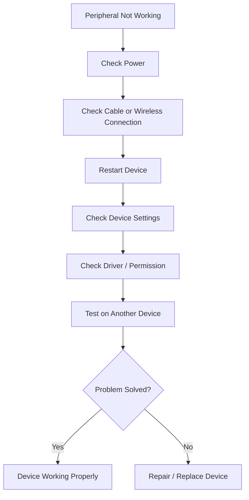

---

---

# DAY - 5: Operating System Installation and Configuration

## Topic: Windows System Information, Linux Bootable USB, macOS Settings, Ubuntu Installation and Windows 10 Installation Guide

This practical focuses on basic operating system tasks such as checking Windows system information, preparing Linux installation media, changing macOS settings, installing Ubuntu Linux, creating a user account, and preparing a Windows 10 installation guide.

---

## 1. Windows System Information Screenshot

### Objective

To open System Information on a Windows laptop or PC and capture details such as OS version, processor, and RAM.

### Steps Performed

#### Step 1: Open Run Dialog

Press:

```text
Windows Key + R
```

#### Step 2: Open System Information

Type:

```text
msinfo32
```

Then press **Enter**.

#### Step 3: Check System Details

In the System Information window, check the following details:

| Detail | Information Checked |
|---|---|
| OS Name | Windows operating system name |
| Version | Windows version and build |
| Processor | CPU model and speed |
| Installed Physical Memory | RAM installed in the system |
| System Type | 64-bit or 32-bit system |

#### Step 4: Take Screenshot

Take a screenshot showing OS version, processor, and RAM details.

### Screenshot

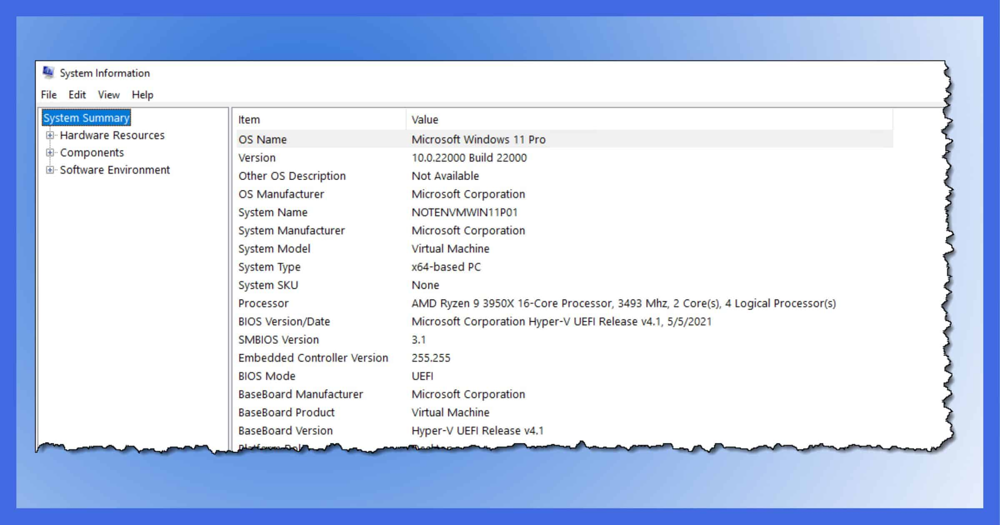

---

## 2. Linux ISO Download and Bootable USB Creation

### Objective

To download an official Linux distribution ISO and create a bootable USB drive using Rufus, Ventoy, or BalenaEtcher.

### Linux Distribution Selected

| Item | Details |
|---|---|
| Linux Distribution | Ubuntu Linux |
| File Type | ISO Image |
| Tools Used | Rufus / Ventoy / BalenaEtcher |
| Installation Method | Bootable USB / Virtual Machine |

---

### Rufus, Ventoy and BalenaEtcher

| Tool | Best For | Main Benefit |
|---|---|---|
| Rufus | Creating a bootable USB for one ISO at a time | Fast, simple, and reliable for Windows/Linux bootable USB creation. |
| Ventoy | Creating a multi-boot USB | Allows multiple ISO files in one USB drive without formatting again and again. |
| BalenaEtcher | Simple ISO flashing | Easy interface for beginners. |

### Why Ventoy Is Useful

Ventoy is useful because we can copy more than one ISO file into the same USB drive.

For example, one USB drive can contain:

| ISO File | Purpose |
|---|---|
| Ubuntu ISO | Linux installation |
| Fedora ISO | Linux installation |
| Kali Linux ISO | Cyber security learning and testing |
| Windows 10 ISO | Windows installation |
| Windows 11 ISO | Windows installation |

At boot time, Ventoy shows a menu, and we can select which operating system ISO we want to boot.

---

### Method 1: Creating Bootable USB Using Rufus

#### Step 1: Download Ubuntu ISO

Download the Ubuntu ISO file from the official Ubuntu website.

#### Step 2: Download Rufus

Download Rufus from its official website.

#### Step 3: Connect USB Drive

Connect a USB drive to the computer.

#### Step 4: Open Rufus

Open Rufus and select the connected USB drive.

#### Step 5: Select ISO File

Click on **Select** and choose the downloaded Ubuntu ISO file.

#### Step 6: Choose Partition Scheme

Select the partition scheme based on the system.

| System Type | Partition Scheme |
|---|---|
| Modern UEFI System | GPT |
| Older BIOS / Legacy System | MBR |

#### Step 7: Start Bootable USB Creation

Click on **Start** and wait until Rufus creates the bootable USB drive.

#### Step 8: Completion

After completion, the USB drive becomes ready for Ubuntu installation.

### Rufus Bootable USB Screenshot

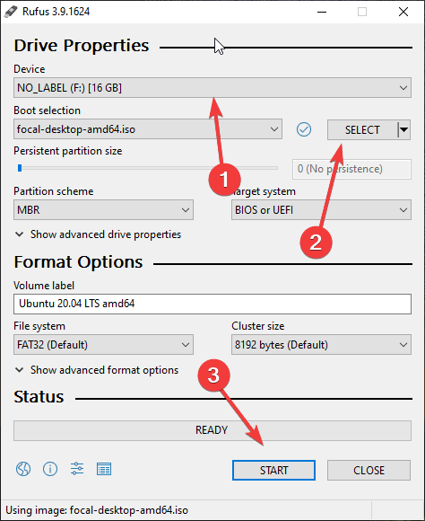

---

### Method 2: Creating Multi-Boot USB Using Ventoy

#### Step 1: Download Ventoy

Download Ventoy from its official website.

#### Step 2: Connect USB Drive

Connect the USB drive to the computer.

#### Step 3: Install Ventoy on USB

Open Ventoy and install it on the selected USB drive.

#### Step 4: Copy ISO Files

After Ventoy installation, copy ISO files directly into the USB drive.

Example ISO files:

| ISO File | Purpose |
|---|---|
| Ubuntu ISO | Linux installation |
| Fedora ISO | Linux installation |
| Kali Linux ISO | Cyber security testing and learning |
| Windows 10 ISO | Windows installation |
| Windows 11 ISO | Windows installation |

#### Step 5: Boot From USB

Restart the computer and open the boot menu.

#### Step 6: Select Ventoy USB

Select the Ventoy USB drive from the boot menu.

#### Step 7: Choose ISO From Ventoy Menu

Ventoy will show all ISO files available in the USB drive. Select the required ISO and start installation.

### Ventoy Multi-Boot USB Screenshot


---

### Method 3: Using VirtualBox If USB Is Not Available

If a spare USB drive is not available, Ubuntu can be tested using VirtualBox.

#### Steps

1. Download and install VirtualBox.
2. Create a new virtual machine.
3. Select Linux as the operating system type.
4. Allocate RAM and virtual hard disk.
5. Mount the Ubuntu ISO file.
6. Start the virtual machine.
7. Begin Ubuntu installation virtually.

### VirtualBox ISO Screenshot

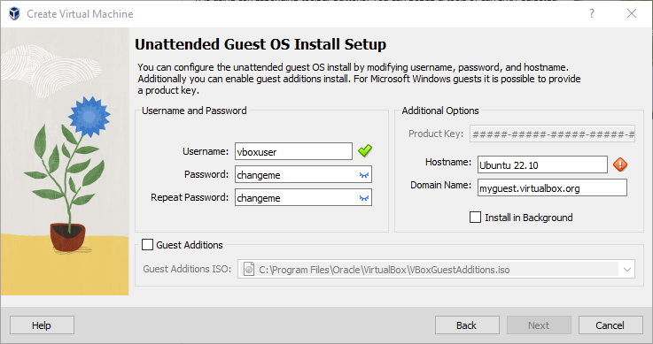

---

## 3. macOS Wallpaper and Language Settings

### Objective

To open System Preferences or System Settings on macOS, change the desktop wallpaper, and adjust the system language to Hindi or Gujarati.

### Steps to Change Desktop Wallpaper

#### Step 1: Open System Settings

Open:

```text
Apple Menu → System Settings
```

In older macOS versions, it may be shown as:

```text
Apple Menu → System Preferences
```

#### Step 2: Open Wallpaper Settings

Select:

```text
Wallpaper
```

or in older versions:

```text
Desktop & Screen Saver
```

#### Step 3: Choose Wallpaper

Select any available wallpaper or choose an image from the system.

#### Step 4: Apply Wallpaper

Set the selected image as the desktop wallpaper.

---

### Steps to Change Language to Hindi or Gujarati

#### Step 1: Open Language Settings

Open:

```text
Apple Menu → System Settings → General → Language & Region
```

In older macOS versions:

```text
System Preferences → Language & Region
```

#### Step 2: Add Language

Click on the **+** button and add Hindi or Gujarati.

#### Step 3: Set Preferred Language

Drag Hindi or Gujarati to the top of the preferred language list.

#### Step 4: Restart If Required

Restart the system if macOS asks to apply language changes.

### macOS Settings Screenshot

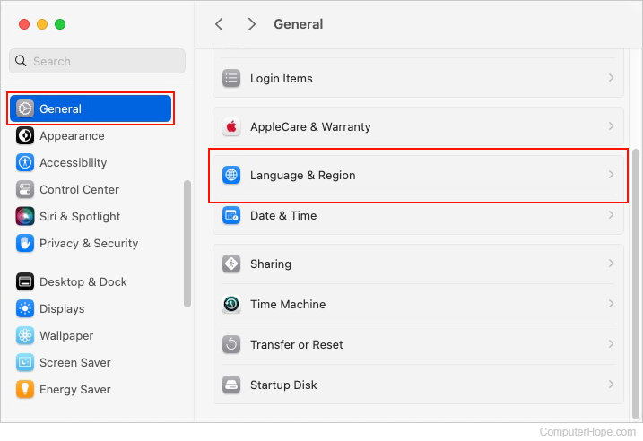

---

## 4. Ubuntu Installation and User Account Creation

### Objective

To install a fresh copy of Ubuntu Linux and create a new user account named **gamer**.

### Installation Method

| Item | Details |
|---|---|
| Operating System | Ubuntu Linux |
| Installation Type | Fresh Installation / Virtual Machine |
| Username | gamer |
| Login Setting | Automatic Login Enabled |

---

### Ubuntu Installation Steps

#### Step 1: Boot From Ubuntu ISO

Start the computer or virtual machine using the Ubuntu ISO file.

#### Step 2: Select Install Ubuntu

Choose the **Install Ubuntu** option.

#### Step 3: Select Keyboard Layout

Choose the preferred keyboard layout.

#### Step 4: Select Installation Type

Choose installation type according to requirement.

| Option | Use |
|---|---|
| Normal Installation | Installs common apps and utilities. |
| Minimal Installation | Installs only basic system tools. |

#### Step 5: Select Disk Setup

For a virtual machine or fresh system, choose the guided installation option.

#### Step 6: Create User Account

Create a new user account with the following details:

| Field | Value |
|---|---|
| Name | gamer |
| Username | gamer |
| Password | Created during installation |

#### Step 7: Enable Automatic Login

Select the option:

```text
Log in automatically
```

#### Step 8: Complete Installation

Wait for installation to finish and restart the system.

#### Step 9: Verify Login Screen

After restart, verify that the user account **gamer** is visible.

### Ubuntu Login Screenshot

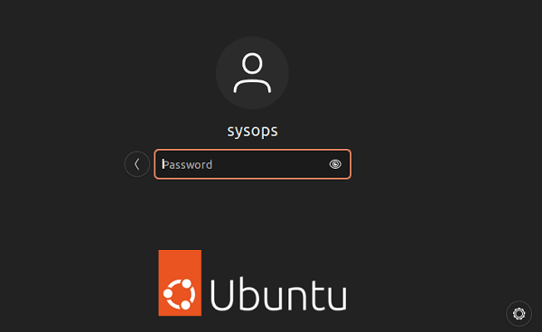

---

## 5. Step-by-Step Guide for Installing Windows 10 on a Laptop

### Objective

To prepare a step-by-step guide for installing Windows 10, including partitioning tips and post-installation privacy and update settings.

---

## Windows 10 Installation Requirements

| Requirement | Details |
|---|---|
| Windows 10 ISO / Bootable USB | Required for installation |
| USB Drive | Minimum 8 GB recommended |
| Laptop Charger | Keeps laptop powered during installation |
| Backup | Important files should be backed up before installation |
| Product Key / Digital License | Required for activation |
| Internet Connection | Needed for updates and drivers |

---

## Windows 10 Installation Steps

### Step 1: Backup Important Data

Before installing Windows 10, copy important files to an external drive, cloud storage, or another safe location.

**Reason:** Installation or partition changes may delete existing data.

---

### Step 2: Create Windows 10 Bootable USB

Create a bootable USB drive using Windows Media Creation Tool, Rufus, or Ventoy.

| Tool | Use |
|---|---|
| Windows Media Creation Tool | Official method for creating Windows installation USB. |
| Rufus | Useful for creating a bootable USB from Windows ISO. |
| Ventoy | Useful for storing multiple ISO files in one USB drive. |

---

### Step 3: Connect Bootable USB

Insert the bootable USB drive into the laptop.

---

### Step 4: Open BIOS / UEFI or Boot Menu

Restart the laptop and press the required key to open BIOS/UEFI settings or the Boot Menu.

### Common BIOS / UEFI Setup Keys

| Key | Use |
|---|---|
| F2 | Common BIOS/UEFI setup key for many laptops. |
| Delete / Del | Common BIOS setup key for desktop motherboards. |
| Esc | Used in some laptops to open startup menu. |
| F10 | Common BIOS key in some HP systems. |

### Common Boot Menu Keys

| Brand | Common Boot Menu Key |
|---|---|
| Dell | F12 |
| HP | Esc / F9 |
| Lenovo | F12 / Novo Button |
| Acer | F12 |
| ASUS | Esc / F8 |
| MSI | F11 |
| Gigabyte Motherboard | F12 |
| Intel Motherboard | F10 |

### Difference Between BIOS and Boot Menu

| Option | Purpose |
|---|---|
| BIOS / UEFI Setup | Used to change system settings like boot order, secure boot, virtualization, date/time, and hardware settings. |
| Boot Menu | Used to directly select a boot device such as USB drive, SSD, HDD, or DVD for one-time boot. |

After opening the boot menu, select the bootable USB drive created using Rufus, Ventoy, or Windows Media Creation Tool.

---

### Step 5: Select USB Drive

Select the bootable USB drive from the boot menu.

---

### Step 6: Choose Language and Keyboard

Select language, time format, and keyboard layout.

Then click:

```text
Next → Install Now
```

---

### Step 7: Enter Product Key

Enter the Windows product key if available.

If not available, select:

```text
I don't have a product key
```

Activation can be completed later if a valid digital license is available.

---

### Step 8: Select Windows Edition

Choose the Windows 10 edition according to the license, such as Windows 10 Home or Windows 10 Pro.

---

### Step 9: Accept License Terms

Read and accept the license terms.

---

### Step 10: Choose Installation Type

Select:

```text
Custom: Install Windows only
```

This option is used for a fresh installation.

---

## Partitioning Tips

### Recommended Partition Plan

| Partition | Suggested Use |
|---|---|
| EFI / System Reserved | Created automatically by Windows for boot files. |
| C Drive | Windows installation and software. |
| D Drive | Personal files, documents, videos, and backups. |

### Important Partition Tips

1. Do not delete recovery partitions unless required.
2. Back up data before deleting or formatting any partition.
3. Install Windows on the SSD for better speed.
4. Keep enough space for C Drive.
5. Use D Drive for personal files if possible.
6. For a new blank disk, Windows can automatically create required system partitions.
7. For UEFI systems, use GPT partition style.
8. For older Legacy BIOS systems, use MBR partition style.

---

### Step 11: Select Installation Drive

Select the partition where Windows should be installed.

If it is a fresh system, select unallocated space and click **Next**.

---

### Step 12: Wait for Installation

Windows will copy files, install features, and restart automatically.

---

### Step 13: Complete Initial Setup

After restart, complete the basic setup:

1. Select region.
2. Select keyboard layout.
3. Connect to internet.
4. Create user account.
5. Set password or PIN.

---

## Post-Installation Settings

### 1. Install Drivers

Install required drivers for:

| Driver | Purpose |
|---|---|
| Chipset Driver | Proper motherboard and system performance. |
| Graphics Driver | Better display and gaming performance. |
| Audio Driver | Sound output and microphone support. |
| Wi-Fi / LAN Driver | Internet connectivity. |
| Touchpad Driver | Laptop touchpad functionality. |

---

### 2. Check Windows Update

Open:

```text
Settings → Update & Security → Windows Update → Check for updates
```

Install all important updates.

---

### 3. Privacy Settings

Open:

```text
Settings → Privacy
```

Review and adjust:

| Setting | Recommendation |
|---|---|
| Location | Turn off if not required. |
| Camera | Allow only trusted apps. |
| Microphone | Allow only trusted apps. |
| Diagnostics | Use basic/recommended settings. |
| Background Apps | Disable unnecessary apps. |
| Advertising ID | Turn off for better privacy. |

---

### 4. Install Basic Software

Install commonly required software:

| Software | Use |
|---|---|
| Browser | Internet browsing. |
| Office Suite | Documents and presentations. |
| PDF Reader | PDF files. |
| Media Player | Audio and video. |
| Antivirus / Windows Security | System protection. |
| Driver Utility | Hardware driver support. |

---

### 5. Create Restore Point

Open:

```text
Control Panel → System → System Protection → Create
```

Create a restore point after installing drivers and updates.

---

## Unclear or Missing Steps Noted

| Step | Observation |
|---|---|
| Partition selection | Beginners may find it confusing to decide which partition to format. |
| Driver installation | Some drivers may need to be downloaded manually from the laptop manufacturer website. |
| Boot menu key | Boot key may be different depending on laptop brand. |
| Product key | Users may be confused if they do not have a product key during installation. |
| Privacy settings | Some users may not understand which permissions should be enabled or disabled. |
| BIOS / UEFI settings | Secure Boot, Legacy Mode, and UEFI settings may be confusing for beginners. |

---

## Evidence Files

| File Name | Description |
|---|---|
| day5-system-information.png | Windows System Information screenshot |
| day5-linux-bootable-usb.png | Rufus bootable USB screenshot |
| day5-ventoy-multiboot.png | Ventoy multi-boot USB screenshot |
| day5-virtualbox-ubuntu.png | Ubuntu ISO mounted in VirtualBox screenshot |
| day5-macos-wallpaper-language.png | macOS wallpaper and language settings screenshot |
| day5-ubuntu-gamer-login.png | Ubuntu login screen showing gamer user |

---

## Operating System Practical Flow Diagram

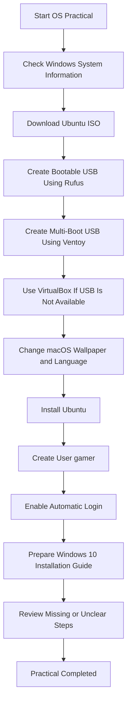

---

